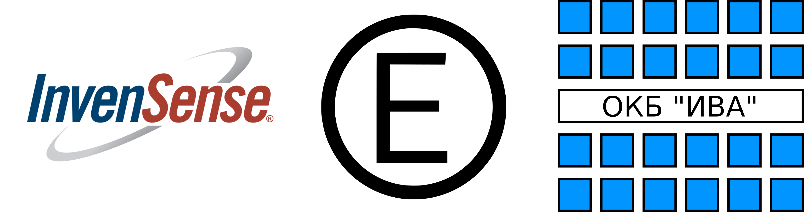

# ICM42688 Barsotion ESP32 driver

#### ``void ICM42688_Init(ICM42688_t *hicm, ICM42688_Config_t *cfg)``
#### ``void ICM42688_regBankSelect(ICM42688_t *hicm, uint8_t bank)``
#### ``void ICM42688_flushFIFO(ICM42688_t *hicm)``
-----------
## Readings
### ``void ICM42688_readWhoAmI(ICM42688_t *hicm, uint8_t *buf)``
Reading ``WHO_AM_I`` register value.
### ``void ICM42688_readRegAG(ICM42688_t *hicm, int32_t *raw)``
Reading gyroscope's and accelerometer data via data registers. The methode uses a single byte reading function.
### ``void ICM42688_readFIFO(ICM42688_t *hicm, int32_t *raw)``
Reading gyroscope's and accelerometer's data via FIFO. The FIFO must be initialized before. The methode means that the FIFO packet is 20-byte size and contains 20-bit gyroscope's and accelerometer's extentions.
---
## Calculations
### ``void ICM42688_calculateGyro(ICM42688_t *hicm, int32_t *raw)``
### ``void ICM42688_calculateAccel(ICM42688_t *hicm, int32_t *raw)``

## Settings
### ``void ICM42688_setGyroODR(ICM42688_t *hicm, ICM42688_GYRO_ODR_t odr)``
### ``void ICM42688_setAccelODR(ICM42688_t *hicm, ICM42688_ACCEL_ODR_t odr)``
### ``void ICM42688_setGyroScale(ICM42688_t *hicm, ICM42688_GYRO_FS_SEL_t scale)``
### ``void ICM42688_setAccelScale(ICM42688_t *hicm, ICM42688_ACCEL_FS_SEL_t scale)``
### ``void ICM42688_setInterruptConfig(ICM42688_t *hicm, ICM42688_INT_Config_t *cfg)``
### ``void ICM42688_setINT1Config(ICM42688_t *hicm, ICM42688_INT_Channel_Config_t *ch)``
### ``void ICM42688_setINT2Config(ICM42688_t *hicm, ICM42688_INT_Channel_Config_t *ch)``
### ``void ICM42688_setFIFOMode(ICM42688_t *hicm, ICM42688_FIFO_MODE_t mode)``
### ``void ICM42688_setFIFOWatermark(ICM42688_t *hicm, uint16_t watermark)``
### ``void ICM42688_setGyroUIFiltBandwidth(ICM42688_t *hicm, ICM42688_GYRO_UI_FILT_BW_t bw)``
### ``void ICM42688_setGyroUIFiltOrder(ICM42688_t *hicm, ICM42688_GYRO_UI_FILT_ORD_t ord)``

### ``void ICM42688_gyroAntiAliasFilterEnable(ICM42688_t *hicm)``
### ``void ICM42688_gyroAntiAliasFilterDisable(ICM42688_t *hicm)``
### ``void ICM42688_gyroNotchFilterEnable(ICM42688_t *hicm)``
### ``void ICM42688_gyroNotchFilterDisable(ICM42688_t *hicm)``
### ``void ICM42688_gyroSetAAF_DELT(ICM42688_t *hicm, uint8_t delt)``
### ``void ICM42688_gyroSetAAF_DELTSQR(ICM42688_t *hicm, uint16_t deltsqr)``
### ``void ICM42688_gyroSetAAF_BITSHIFT(ICM42688_t *hicm, uint8_t bitshift)``
---
## Filtering
### ``void ICM42688_filterInit(ICM42688_t *hicm, float cycle_time)``
### ``void ICM42688_filterGyro(ICM42688_t *hicm)``
### ``void ICM42688_filterAccel(ICM42688_t *hicm)``
---
## Calibration
### ``void ICM42688_calibrateGyro(ICM42688_t *hicm)``
---
## IRQ flag status check
### ``bool ICM42688_UI_FSYNC_IRQ_Check(ICM42688_t *hicm)``
### ``bool ICM42688_PLL_RDY_IRQ_Check(ICM42688_t *hicm)``
### ``bool ICM42688_RESET_DONE_IRQ_Check(ICM42688_t *hicm)``
### ``bool ICM42688_DATA_RDY_IRQ_Check(ICM42688_t *hicm)``
### ``bool ICM42688_FIFO_THS_IRQ_Check(ICM42688_t *hicm)``
### ``bool ICM42688_FIFO_FULL_IRQ_Check(ICM42688_t *hicm)``
### ``bool ICM42688_AGC_RDY_IRQ_IRQ_Check(ICM42688_t *hicm)``
