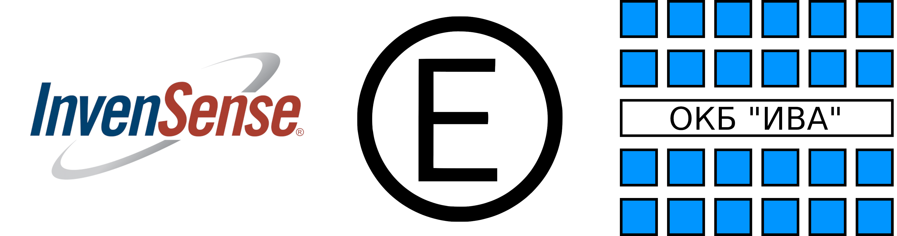
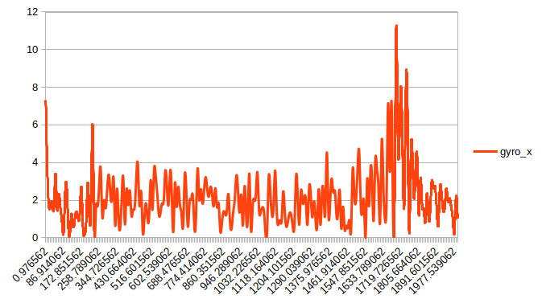
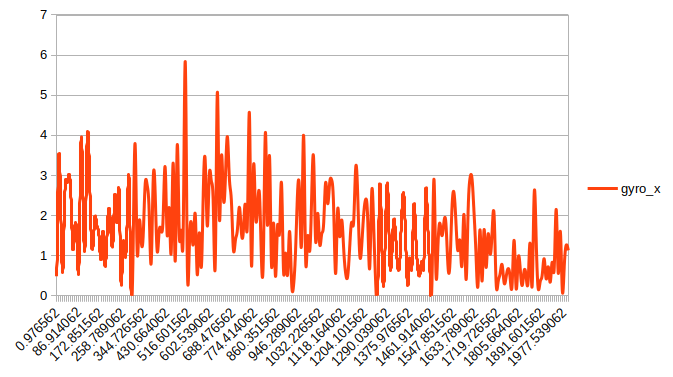

# ICM42688 Barsotion ESP32 driver

[Methods descriptions](./methods_descriptions.md)

[ICM-42688-P Barsotion devboard](https://github.com/Barsy-Barsevich/Barsotion-AH1)

## Examples
### Specter diagram example
*Source code:* [spectre.c](./examples/spectre.c)
AAF (anti-alias filter) disabled, notch filter <ins>disabled</ins>, ODR=4kHz:

AAF disabled, notch filter <ins>enabled</ins>, ODR=4kHz:

## Contacts for Q&A
Email: barsotion@yandex.ru
Telegram: @barsybarsevich
## TODO

- [ ] Add library recursive calibration method
- [ ] Clean examples
- [ ] Create methods descriptions